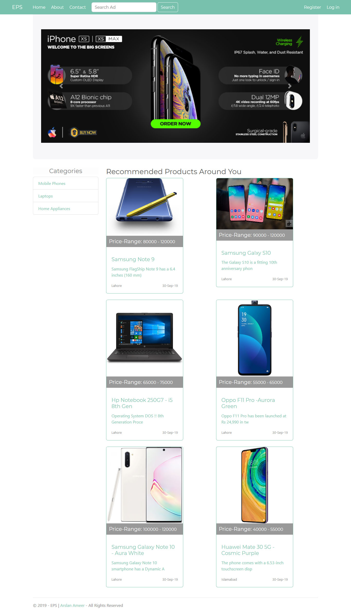
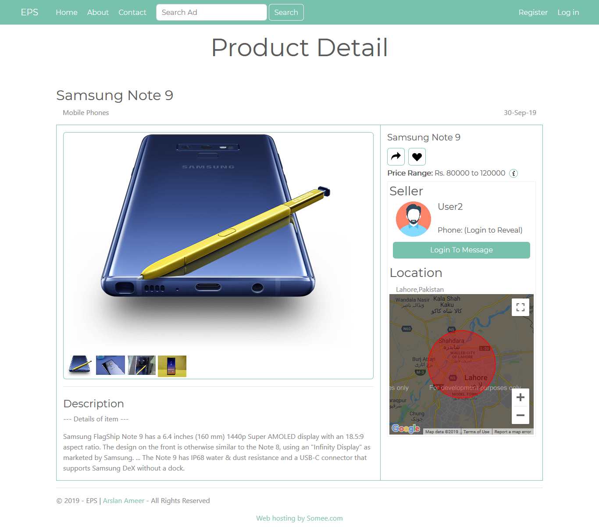

# EPS System (Exchange Prodyct System) 🏔
EPS 🕸 Exchange Product System - Online Product Exchange 🛒Site made with Asp.Net MVC Technology using C#, Bootstrap, jQuery, Ajax, HTML5, CSS3, SQL, and Entity Framework.

**_Has:_** Admin panel ⚙ through which one can manage 💻 registered users 👷‍♂️ and there respective ads 🎊.
and Panel for each user to manage his ads.
### **LIVE DEMO. [TRY NOW](http://www.epsystem.tk/)** 😍

---
### Demo Image 🖼:
- Home Page

- Product Detail Page

# DEMO ✨

---
# **ITS LIVE. [TRY NOW](http://www.epsystem.tk/)** 😍
---
## 💡**NOTE :**
This is only a demonstration of my work or project done, & This website is not ready to shop online right now.
Some of services like site analytics, traffic tracking, api services will added later (On Demand).

[ © Copyrights [Arslan Ameer](http://www.arslanameer.com) ]

---
# 🔐LICENSE:

*EPS-Exchange Product System* (c) Copyrights 2019 by **_[Arslan Ameer](http://www.arslanameer.com)_**

*EPS-Exchange Product System* is licensed under a
Creative Commons Attribution-NonCommercial-NoDerivatives 4.0 International License.

You should have received a copy of the license along with this
work. If not, see <http://creativecommons.org/licenses/by-nc-nd/4.0/>.
